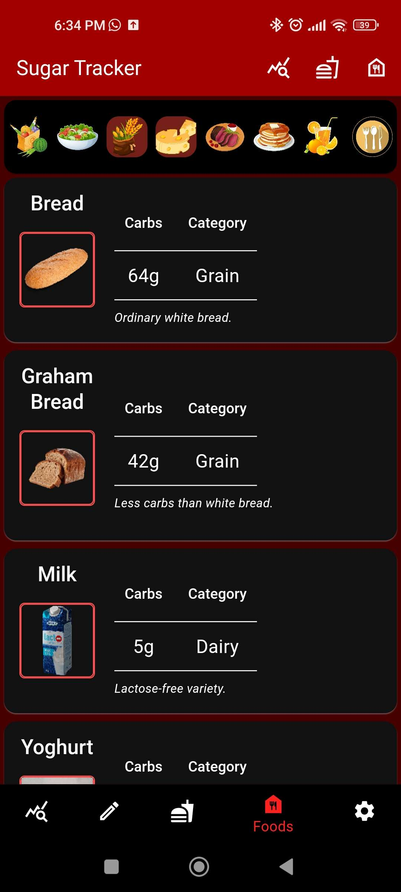

# Sugar Tracker
Automated calculation of necessary insulin units for a given meal and sugar level.
For tracking sugar levels and insulin given per meal.

## Features

### Meals tab

Meals are visible in the meals tab.

Create a meal by tapping the meals option in the upper right corner of the screen.

 

Tapping on the "Food" button will show your list of foods to chosoe from.
Add a food item to your meal by tapping the number under the picture (0g by default) and enter the amount of grams weighed.

You can edit a food item by tapping on its card, just like in the foods tab.

Additional features such as duplicating, editing, sharing and more are available by tapping the trailing icon of the meal tab.

Meal notes are visible by tapping the trailing notes icon on the meals nameplate.

### Foods tab

Food items are visible in the foods tab.

Add food items to the app by tapping the food bank option in the upper right corner of the screen. 

 

By tapping on the picture you can choose to upload an image from your gallery or take one on the spot - images are stored in low quality to save space (the submit button is not visible in the picture, it's below the food categories grid).

Additional features such as duplicating, editing, sharing and more are available by tapping the food item card.

### Sugar levels and Insulin units tabs

Sugar levels and insulin units taken are visible in their respective tabs.

Additional features such as duplicating, editing, sharing and more are available by tapping the trailing icon of the entry.

The Sugars and Insulin tabs are nearly identical, the only difference being that the sugars tab shows the sugar level first, insulin units second and carbs third, whereas the insulin tab shows the insulin units first, sugar level second and carbs third.

The card's nameplate color and trailing icon will change based on the insulin type given and depending on whether or not a meal is attached to the measurement.

Editing and creation of entries are done via identical forms.

If you only intend to log your sugar level, you can leave the insulin field empty and it will not be stored, and vice-versa.

Insulin will automatically be given the name of the appropriate insulin type, based on your history of insulin intake. For example, if the insulin type selected is Basal and the latest insulin of that type in your history has the name "Tresiba" then it will automatically be given the name "Tresiba". Additional notes are optional.

If a note is added, then the note can be seen by tapping on the sugar level (sugar levels that have notes are <u>underlined</u>). If the note includes the keyword "libre" then it is <u style="text-decoration-style: wavy; text-decoration-color: red;">underlined in red</u>.

### Settings tab

The settings tab contains datetime display settings, profile settings, advanced database settings and backup options (since the data is stored locally and not online).

The table editor is meant to be used by developers and users with an understanding of SQL.

## Disclaimer
This app was made while I was bored out of my mind at the hospital after discovering I had diabetes.
My own doctors at the hospital were utterly incompetent and were unable to tell me how to calculate insulin units for my meals, so I had to find diabetics whose doctors were actually competent to inform me.

I personally use this app every day, and have designed it in accordance with advice from doctors, but it has not been offically developed in cooperation with medical personnel and is not officially approved by any medically trained individuals or organizations. You take full responsibility for your personal use of the application.

None of the images used for the default food items in the database were created by me, all credit goes to their original creators. I do not guarantee the validity of the carbohydrate data as it pertains to the default food items and it is your responsibility to modify it to reflect the values you will use.

